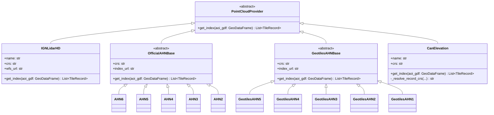

```mermaid
classDiagram
    class PointCloudProvider {
        <<abstract>>
        +get_index(aoi_gdf: GeoDataFrame) List~TileRecord~
    }

    class IGNLidarHD {
        +name: str
        +crs: str
        +wfs_url: str
        +get_index(aoi_gdf: GeoDataFrame) List~TileRecord~
    }

    class OfficialAHNBase {
        <<abstract>>
        +crs: str
        +index_url: str
        +get_index(aoi_gdf: GeoDataFrame) List~TileRecord~
    }

    class GeotilesAHNBase {
        <<abstract>>
        +crs: str
        +index_url: str
        +get_index(aoi_gdf: GeoDataFrame) List~TileRecord~
    }

    class CanElevation {
        +name: str
        +crs: str
        +get_index(aoi_gdf: GeoDataFrame) List~TileRecord~
        -_resolve_record_crs(...) str
    }

    %% Inheritance relationships
    PointCloudProvider <|-- IGNLidarHD
    PointCloudProvider <|-- OfficialAHNBase
    PointCloudProvider <|-- GeotilesAHNBase
    PointCloudProvider <|-- CanElevation

    %% Derived AHN classes
    OfficialAHNBase <|-- AHN6
    OfficialAHNBase <|-- AHN5
    OfficialAHNBase <|-- AHN4
    OfficialAHNBase <|-- AHN3
    OfficialAHNBase <|-- AHN2

    GeotilesAHNBase <|-- GeotilesAHN5
    GeotilesAHNBase <|-- GeotilesAHN4
    GeotilesAHNBase <|-- GeotilesAHN3
    GeotilesAHNBase <|-- GeotilesAHN2
    GeotilesAHNBase <|-- GeotilesAHN1
```
